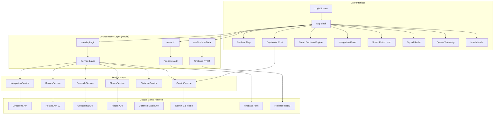
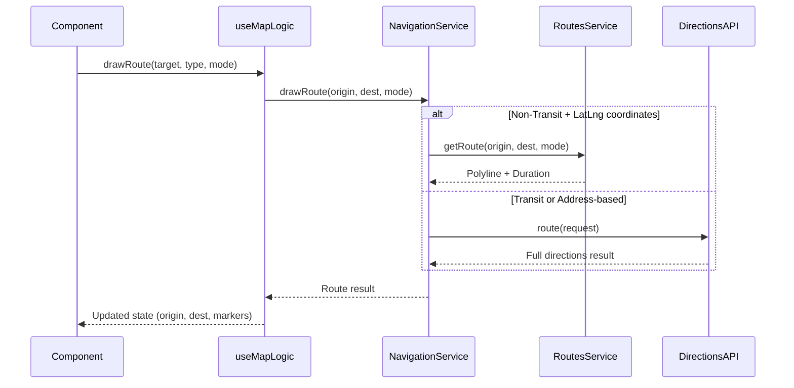
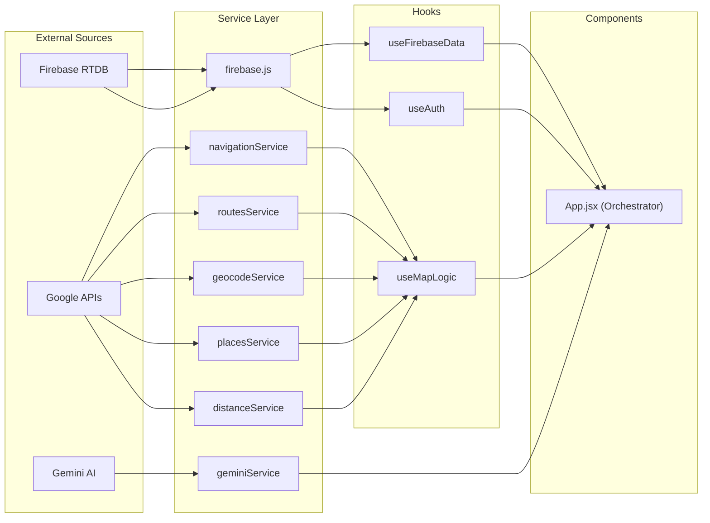
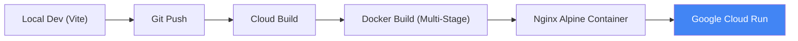

# 🏏 Yellove OS — System Architecture

> **Yellove OS** is a next-generation **Smart Stadium Operating System** engineered for the Chennai Super Kings at MA Chidambaram Stadium (Chepauk). It fuses real-time crowd intelligence, multi-modal transit orchestration, and Gemini-powered tactical AI into a single, immersive fan experience platform.

---

## Table of Contents

- [Core Philosophy](#core-philosophy)
- [High-Level System Overview](#high-level-system-overview)
- [Layered Architecture](#layered-architecture)
  - [Presentation Layer](#1-presentation-layer)
  - [Orchestration Layer](#2-orchestration-layer)
  - [Service Layer](#3-service-layer)
  - [Utility Layer](#4-utility-layer)
- [Feature Breakdown](#feature-breakdown)
  - [🔐 Authentication & Identity](#-authentication--identity)
  - [🗺️ Real-Time Stadium Topography](#️-real-time-stadium-topography)
  - [🧠 Gemini AI — Captain Mode](#-gemini-ai--captain-mode)
  - [📊 Smart Decision Engine](#-smart-decision-engine)
  - [🚇 Multi-Modal Transit Orchestration](#-multi-modal-transit-orchestration)
  - [🧭 Precision Navigation System](#-precision-navigation-system)
  - [🔥 Match Mode — Live Simulation](#-match-mode--live-simulation)
  - [👥 Squad Radar — Friend Tracking](#-squad-radar--friend-tracking)
  - [📢 Broadcast System](#-broadcast-system)
  - [📊 Queue Telemetry](#-queue-telemetry)
- [Data Flow Architecture](#data-flow-architecture)
- [Google Cloud API Integration Map](#google-cloud-api-integration-map)
- [Deployment Pipeline](#deployment-pipeline)
- [Testing Strategy](#testing-strategy)
- [Coding Standards & Conventions](#coding-standards--conventions)
- [Tech Stack](#tech-stack)

---

## Core Philosophy

Yellove OS is built on three foundational principles:

| Principle | Implementation |
|---|---|
| **Service-Oriented Architecture (SOA)** | Strict separation between UI components and domain logic. Every external API interaction is encapsulated within a dedicated service module. |
| **Dual-Mode Intelligence** | Every AI feature works in two modes — **Live Gemini API** when a key is configured, and an **Intelligent Tactical Simulation** fallback that guarantees 100% availability without any API key. |
| **Real-Time First** | Firebase Realtime Database subscriptions push crowd, queue, and transport data to the UI instantly. No polling. No stale data. |

---

# Problem Alignment

Yellove OS is architected to solve the "Stadium Last-Mile Problem" by mapping technical capabilities directly to real-world fan frustrations.

| Problem | Technical Mitigation | System Component |
|---|---|---|
| **Crowd Congestion** | Real-time heatmap analysis and reactive re-routing. | `StadiumMap` & `decisionEngine` |
| **Inefficient Navigation** | Multi-modal pathfinding that prioritizes low-density gates. | `NavigationService` & `useMapLogic` |
| **Transport Decisions** | Batch ETA comparison across 4 transit modes. | `SmartReturnHub` & `DistanceMatrix` |

## Intelligent Response Flow
The system processes stadium inquiries through a cascaded intelligence pipeline:

1. **User Input**: Conversational query (e.g., "Fastest way to Anna Nagar?").
2. **Geocoding**: Precision mapping of input to `{lat, lng}` using `geocodeService`.
3. **Transport Options**: Discovery of available stations via `placesService`.
4. **ETA Calculation**: Batch performance assessment via `distanceService`.
5. **Routing**: Path generation via `navigationService` (Transit) or `routesService` (Drive).
6. **AI Recommendation**: Final tactical briefing delivered by **Captain AI**.

---

## High-Level System Overview



---

## Layered Architecture

### 1. Presentation Layer
**Directory:** `/src/components`

The UI layer is built with React 19 and uses lazy loading via `React.lazy()` + `Suspense` for code-split, performance-optimized rendering. Every component is wrapped in `React.memo()` to prevent unnecessary re-renders.

| Component | Purpose | Key Features |
|---|---|---|
| `LoginScreen.jsx` | Authentication portal | Email/password login, account registration, Firebase Auth integration, input validation, dual-mode (login/register) toggle |
| `GoogleStadiumMap.jsx` | Live Google Maps renderer | Displays computed routes, waypoints, markers, and real-time path overlays when navigation is active |
| `StadiumMap.jsx` | Stadium crowd heatmap | SVG-based crowd density visualization across 8 stadium stands when no route is active |
| `CaptainAI.jsx` | Gemini-powered AI chat | Conversational interface with quick-action buttons (Food, Entry, Emergency, Transport), real-time thinking indicators, XSS-safe input via DOMPurify |
| `NavigationPanel.jsx` | Turn-by-turn navigation | Full routing UI with Google Places Autocomplete, 4 travel modes (Cab/Bus/Metro/Train), cascading mode search, tactical transit narratives, step-by-step maneuver cards |
| `SmartReturnPanel.jsx` | Post-match transit hub | Nearby transport discovery with live wait times, capacity bars, Google Places Autocomplete for destination search, one-tap transit app deep links |
| `QueueCard.jsx` | Queue wait time display | Compact telemetry card for food/restroom amenity wait times |

**Rules:**
- Components contain **zero** direct API calls. All data must flow through Hooks or be passed as props.
- No direct `window.google` access — use constants and services provided by the service layer.

---

### 2. Orchestration Layer
**Directory:** `/src/hooks`

Custom React Hooks serve as the **bridge** between the Presentation and Service layers. They manage state lifecycles, coordinate multi-service operations, and expose clean APIs to components.

| Hook | Role | Functions Exposed |
|---|---|---|
| `useAuth` | Firebase Authentication lifecycle | `login(email, pw)`, `register(email, pw, name)`, `logout()`, `user` state |
| `useMapLogic` | Stadium navigation state machine | `drawRoute()`, `calculateAddressRoute()`, `fetchTransitOptions()`, `clearRoutes()`, route state (origin, destination, waypoints, routeColor, markers) |
| `useFirebaseData` | Real-time Firebase Realtime Database subscriptions | `data`, `setData` (for Match Mode simulation), `loading` — with built-in mock data fallback |

**How `useMapLogic` orchestrates routing:**



---

### 3. Service Layer
**Directory:** `/src/services`

The **single point of contact** for all external API interactions. **No other layer may directly call Google APIs.** Every service is exported through a centralized `index.js` barrel file.

| Service | Google API | Purpose |
|---|---|---|
| **`navigationService.js`** | Directions API (v1) | Path calculation with full turn-by-turn maneuvers. Primary for all Transit routing. Handles mode normalization (e.g., "train" → `TRANSIT`), transit option injection (RAIL/SUBWAY/BUS constants), and cascading fallback from Routes API failures. |
| **`routesService.js`** | Routes API (v2 — Compute Routes) | High-precision path computation for non-transit, coordinate-based requests. Uses the modern REST endpoint (`routes.googleapis.com/directions/v2:computeRoutes`). Falls back to `navigationService` if it fails. |
| **`geocodeService.js`** | Geocoding API | Converts human-readable address strings ("Anna Nagar, Chennai") into `{lat, lng}` coordinate pairs for routing. |
| **`placesService.js`** | Places API (Nearby Search) | Discovers real transit hubs near the stadium — Metro stations, MRTS/Local Train stations, Bus stops, Taxi stands. Runs parallel searches across `train_station`, `transit_station`, `subway_station`, `bus_station`, and `taxi_stand` types. Includes deep-links to transit apps (CMRL, UTS, MTC, Ola). |
| **`distanceService.js`** | Distance Matrix API | Batch ETA calculation from stadium to multiple transport hubs simultaneously. Provides real-time travel time and distance metrics for the Smart Return Hub. |
| **`geminiService.js`** | Gemini 1.5 Flash (Generative AI) | Dual-mode intelligence engine — live Gemini API with CSK-themed system prompt, or tactical simulation fallback with weighted mode recommendation (Speed vs Cost vs Availability scoring). |
| **`firebase.js`** | Firebase Auth + Realtime Database + Analytics | Core infrastructure — authentication, real-time data subscriptions (crowd density, queue times, transport availability), and usage analytics event logging. |

**Routing Strategy — Why Two APIs?**

```
Routes API v2 (routesService)     Directions API v1 (navigationService)
──────────────────────────────    ──────────────────────────────────────
✅ Modern REST endpoint            ✅ Full step-by-step maneuvers
✅ Faster for DRIVE/WALK            ✅ Transit mode support (RAIL, SUBWAY, BUS)
✅ Polyline + duration              ✅ Works with address strings
❌ No transit step details          ✅ Chennai MRTS/suburban rail support
❌ Requires lat/lng coordinates     ✅ Waypoint support

Strategy: Routes API → primary for driving/walking with coordinates
           Directions API → primary for ALL transit + address-based queries
           Automatic fallback: Routes → Directions if Routes fails
```

---

### 4. Utility Layer
**Directory:** `/src/utils`

Pure, deterministic functions with zero side effects. These are the **calculators** of the system — given the same input, they always produce the same output.

| Utility | Purpose |
|---|---|
| `decisionEngine.js` | Analyzes crowd density, queue times, and transport availability to compute the optimal entry gate, exit gate, food venue, and transport mode. Powers the "Smart Decision Engine" UI panel. |
| `navigationUtils.js` | Route configuration helper — maps route types (food, emergency, general, address, transport) to specific colors and waypoint configurations. |
| `index.js` | Barrel export for all utilities. |

---

## Feature Breakdown

### 🔐 Authentication & Identity

| Aspect | Detail |
|---|---|
| **Provider** | Firebase Authentication (Email/Password) |
| **Registration** | Full name + email + password → `createUserWithEmailAndPassword` → `updateProfile` → `sendEmailVerification` |
| **Login** | Email + password → `signInWithEmailAndPassword` |
| **Session** | `onAuthStateChanged` listener for persistent auth state across refreshes |
| **Guard** | The entire app is render-gated behind the `user` check — unauthenticated users see only `LoginScreen` |
| **Error Handling** | 8 distinct Firebase error codes mapped to user-friendly messages |

---

### 🗺️ Real-Time Stadium Topography

Two mutually exclusive map views switch based on navigation state:

- **No active route →** `StadiumMap` — SVG heatmap showing crowd density across 8 stadium sections (Stands A–H), color-coded from green (low) to red (high).
- **Active route →** `GoogleStadiumMap` — Full Google Maps embed rendering the computed path with colored polylines, origin/destination markers, and waypoint support.

The map auto-recalculates food routes if crowd density changes while a food route is active (reactive re-routing).

---

### 🧠 Gemini AI — Captain Mode

**"Captain Yellove"** is the AI persona — a strategic assistant themed around CSK's cricket heritage.

**Mode 1 — Live Gemini API:** When `VITE_GEMINI_API_KEY` is configured, queries are sent to Gemini 1.5 Flash with a full system prompt that includes:
- Live crowd density data
- Current queue wait times
- Available transport options
- Personality: CSK-themed tactical responses ("Whistle Podu", "Thala", team spirit)

**Mode 2 — Tactical Simulation:** When no API key is present, the fallback engine provides intelligent responses using:
- **Weighted scoring** across Speed, Cost, and Availability dimensions
- **Intent detection** — parses queries for route, crowd, cost, and speed keywords
- **Gate analysis** — compares Gate 3 vs Gate 5 crowd loads for optimal entry/exit recommendations

**Quick Actions** (bypass Gemini for instant UX):
| Button | Action |
|---|---|
| Find Food | Routes to lowest-wait food amenity |
| Clear Entry | Routes to least-crowded gate |
| Emergency Exit | Immediate route to Gate 3 (primary emergency gate) |
| Return Home | Opens Smart Return Hub with live transit options |

---

### 📊 Smart Decision Engine

A deterministic analysis engine (`decisionEngine.js`) that continuously evaluates all stadium data to produce **5 actionable recommendations**:

```
┌─────────────┐   ┌─────────────┐   ┌─────────────┐
│ Crowd Data  │   │ Queue Data  │   │Transport Data│
│ (8 stands)  │   │ (food/WC)   │   │ (4 modes)   │
└──────┬──────┘   └──────┬──────┘   └──────┬──────┘
       │                 │                 │
       └─────────┬───────┘                 │
                 │                         │
         ┌───────▼─────────────────────────▼──┐
         │       Smart Decision Engine        │
         │  (Pure function, zero side-effects) │
         └───────────────┬────────────────────┘
                         │
    ┌────────────────────┼────────────────────┐
    │           │        │        │            │
    ▼           ▼        ▼        ▼            ▼
Best Entry  Best Exit  Best    Best       Precision
  Gate        Gate     Food   Transport    Routing
```

Each recommendation includes a **reason** explaining the decision logic (e.g., "Lowest crowd load, saves 4 mins"). Clicking any card instantly draws the optimal route on the map.

---

### 🚇 Multi-Modal Transit Orchestration

The most sophisticated subsystem — handles the complete journey from stadium to any destination in Chennai via any transit mode.

**Supported Modes:**
| Mode | Google Travel Mode | Special Logic |
|---|---|---|
| **Cab/Taxi** | `DRIVING` | Direct Routes API path |
| **Metro** | `TRANSIT` (SUBWAY) | CMRL-specific, restricts to subway-only results |
| **Local Train** | `TRANSIT` (RAIL) | Origin override to Chepauk MRTS station (13.0645, 80.2810), waypoint insertion via Chennai Beach hub for north/west destinations |
| **Bus (MTC)** | `TRANSIT` (BUS) | Restricts to bus-only transit results |

**Cascading Mode Search Strategy:**
```
User selects "Train" for Anna Nagar
         │
         ▼
Step 1: Try RAIL-only routing
         │
    ❌ Unreachable (>5km walk to final stop)
         │
         ▼
Step 2: Try RAIL + SUBWAY combo
         │
    ❌ Still fails
         │
         ▼
Step 3: Try RAIL + SUBWAY + BUS (full multi-modal)
         │
    ✅ Returns: Walk → MRTS → Metro → Bus → Walk
         │
         ▼
Step 4: Generate tactical narrative
         "Walk 400m to Chepauk Station. Board MRTS
          towards Beach. Switch to Blue Line Metro..."
```

**Smart Return Hub (`SmartReturnPanel`):**
- Google Places Autocomplete for custom destination search
- Live transport cards with wait times, capacity bars, and walking distances
- One-tap deep-links to transit booking apps (CMRL, UTS, MTC, Ola)
- Sorted by composite score: `(wait time) - (capacity / 10)`

---

### 🧭 Precision Navigation System

Full turn-by-turn navigation panel (`NavigationPanel`) with:

- **Google Places Autocomplete** on both origin and destination fields (restricted to India)
- **4 travel mode selector** — Cab, Bus, Metro, Train with visual mode cards
- **Origin/Destination swap** button for reverse routing
- **Step-by-step maneuver cards** with:
  - Transit line badges (line name, short code, vehicle type)
  - Board/alight station indicators
  - CSK-themed tactical advice per step:
    - *Metro Logistics*: "Get your Metro QR ticket via CMRL App to skip the counter"
    - *Rail Intel*: "Use UTS App for instant paperless tickets"
    - *First-Mile Buffer*: "Significant walking distance — you might prefer a quick Auto"
    - *Transfer Advice*: "Switch modes now to reach your final destination"
- **Tactical Briefing** — a CSK-themed narrative summary of the entire journey
- **Chennai-aware intelligence** — detects Chepauk MRTS, Beach Station hub, Government Estate Metro, and forces context-appropriate station guidance

---

### 🔥 Match Mode — Live Simulation

Toggle that activates a **real-time simulation** of match-day conditions:

- Crowd density across all 8 stands fluctuates every 4 seconds (±5 from current, clamped 5–99)
- Random **momentum alerts** with 10% probability per tick:
  - "🔥 DECIBEL SPIKE: Massive roar at Pavilion!"
  - "⚡ MOMENTUM SHIFT: Wicket taken! Gates 3/4 experiencing surge."
  - "🍦 FLASH DEAL: 50% off at Dhoni Diner for next 2 overs!"
- **Squad Radar** positions update dynamically (distance ± 5m, random movement status)
- Visual theme shift — background darkens, red glow effects activate on map section, pulsing fire icon in navbar
- **Match Momentum** gauge shows simulated win probability (83%) with per-over delta

---

### 👥 Squad Radar — Friend Tracking

Displays nearby friends with:
- Avatar initial, name, and current stadium location
- Real-time distance in meters
- Movement status (Moving / Stationary)
- **Ping My Location** button to broadcast position
- Animated during Match Mode with simulated position updates

---

### 📢 Broadcast System

Rotating announcement bar with 4 pre-configured messages cycling every 8 seconds:
- Match moment alerts ("Captain Cool marks his guard")
- Crowd routing advisories ("Gate 3 is experiencing slow traffic")
- Flash offers ("20% off at Super Kings Cafe")
- Strategic timeouts ("Plan your food runs")

Uses `aria-live="polite"` for screen reader accessibility.

---

### 📊 Queue Telemetry

Real-time wait time monitoring for stadium amenities:
- Food outlets (Super Kings Cafe, Dhoni Diner, Quick Bites)
- Restrooms (Washroom Alpha, Washroom Beta)
- Auto-sorted by shortest wait time
- Data sourced from Firebase Realtime Database with mock fallback

---

## Data Flow Architecture



**Key principle:** Data always flows **inward** — Components never reach past Hooks to touch Services directly, and Services never manipulate component state.

---

## Google Cloud API Integration Map

| API | Service File | What It Does in Yellove OS |
|---|---|---|
| **Maps JavaScript API** | `@react-google-maps/api` | Map rendering, polyline drawing, marker placement |
| **Directions API** | `navigationService.js` | Turn-by-turn routing with transit step details |
| **Routes API v2** | `routesService.js` | High-speed polyline + duration computation |
| **Geocoding API** | `geocodeService.js` | Address → coordinates conversion |
| **Places API** | `placesService.js` | Nearby transit hub discovery (metro, train, bus, taxi) |
| **Distance Matrix API** | `distanceService.js` | Batch ETA from stadium to transport hubs |
| **Gemini 1.5 Flash** | `geminiService.js` | Conversational AI with live stadium context |
| **Firebase Auth** | `firebase.js` | Email/password authentication + session management |
| **Firebase RTDB** | `firebase.js` | Real-time crowd, queue, and transport data |
| **Firebase Analytics** | `firebase.js` | Event logging (assistant queries, transport selections) |

---

## Deployment Pipeline



| Stage | Detail |
|---|---|
| **Build Tool** | Vite 8 with React plugin |
| **Container** | Multi-stage Docker — `node:20-slim` for build, `nginx:alpine` for serving |
| **CI/CD** | Google Cloud Build (`cloudbuild.yaml`) with build-time env variable injection |
| **Hosting** | Google Cloud Run (Port 8080, auto-scaling) |
| **SPA Routing** | Custom `nginx.conf` to handle React SPA client-side routing |

**Environment variables** (injected at build-time via Docker ARGs):
- `VITE_FIREBASE_*` — 7 Firebase configuration keys
- `VITE_GOOGLE_MAPS_API_KEY` — Google Maps Platform key
- `VITE_GEMINI_API_KEY` — Gemini AI key

---

## Testing Strategy

| Test File | Coverage Area |
|---|---|
| `App.test.jsx` | Full application rendering, auth gate, main layout |
| `core.test.jsx` | Core component rendering and state management |
| `edge.test.jsx` | Edge cases, error boundaries, null data handling |
| `functions.test.js` | Pure utility function testing (decision engine) |
| `gemini.test.js` | Gemini service dual-mode (API + simulation) |
| `interaction.test.jsx` | User interaction flows, button clicks, form submissions |
| `ui.test.jsx` | Visual state verification, conditional rendering |
| `useAuth.test.js` | Authentication hook state transitions |
| `decisionEngine.test.js` | Decision engine input/output validation |

**Test Stack:** Vitest 4 + React Testing Library + jsdom

---

## Coding Standards & Conventions

| Rule | Rationale |
|---|---|
| **No `window.google` in UI components** | All Google Maps constants must be accessed through Service Layer helpers (e.g., `getTransitConstants()`). Prevents tight coupling and enables testability. |
| **Centralized exports** | Always import services via `src/services/index.js`, never from individual service files. |
| **Cascading fallback** | Every external API call must have a fallback path. Routes API → Directions API. Gemini API → Tactical Simulation. Firebase → Mock Data. |
| **Functional state updates** | State updaters must use functional form (`setState(prev => ...)`) to prevent stale closure bugs in intervals/timeouts. |
| **Lazy loading** | All heavy components (`GoogleStadiumMap`, `NavigationPanel`, `SmartReturnPanel`, `CaptainAI`, `LoginScreen`, `StadiumMap`) are loaded via `React.lazy()` with `Suspense` fallbacks. |
| **Memo everything** | All leaf components are wrapped in `React.memo()` to skip re-renders when props haven't changed. |
| **XSS Safety** | All user-generated input is sanitized through DOMPurify before processing. |
| **Accessible by default** | ARIA labels, `aria-live` regions, skip-to-content links, keyboard focus management, semantic HTML5 elements. |

---

## Tech Stack

| Category | Technology | Version |
|---|---|---|
| **UI Framework** | React | 19.2 |
| **Build Tool** | Vite | 8.0 |
| **Styling** | TailwindCSS | 3.4 |
| **Maps** | @react-google-maps/api | 2.20 |
| **AI** | @google/generative-ai (Gemini) | 0.24 |
| **Backend** | Firebase (Auth + RTDB + Analytics) | 12.12 |
| **Icons** | Font Awesome | 7.2 |
| **Security** | DOMPurify | 3.3 |
| **Testing** | Vitest + React Testing Library | 4.1 / 16.3 |
| **Container** | Docker (node:20-slim → nginx:alpine) | — |
| **Hosting** | Google Cloud Run | — |
| **CI/CD** | Google Cloud Build | — |

---

<div align="center">

**Yellove OS v2.4.0** · Engineered for **Chennai Super Kings** · Chepauk Stadium

*"Process is more important than the result."*

💛 Whistle Podu 💛

</div>

